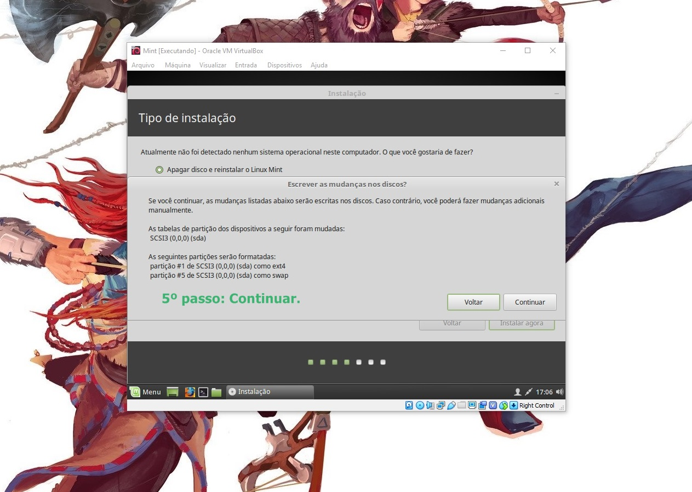

# Tutorial Install Linux Mint 
By: MOYSÉS DOGLIO.

  

 
  
  
 <b>Software Livre - Banco de Dados</b> 

O Oracle é o principal banco de dados atualmente, sendo responsável pelo armazenamento de boa parte das informações das principais organizações ao redor do mundo. Sua participação no mercado de banco de dados é bastante acentuada, principalmente em grande empresas e em conjunto com sistemas de médio e grande porte. O Oracle é muito robusto e exige bastante hardware para um boa performance. Outro fator importante é o gerenciamento, onde são exigidos profissionais bastante capacitados para este fim.

 
 

Um ponto muito alto do banco de dados Oracle é a segurança, principalmente quando bem administrado. Segurança dos dados é um dos principais pontos a analisar no aspecto banco de dados e neste caso o Oracle tem a simpatia de muitas empresas e DBA’s.

A companhia foi fundada em 1977 por Larry Ellison, Bob Miner e Ed Oates com o nome de SDL (Software Development Laboratories) como uma empresa especializada em sistema de gestão de banco de dados relacional (RDBMS) como uma solução alternativa ao IBM System R, em 1979 a companhia mudou o nome para Relational Software, Inc (RSI), a partir de 1982 passou a usar o nome Oracle para se relacionar ao seu produto Oracle.

 

  
  <b><b>Soluções livres - MYSQL</b></b>
  
 <b>Alto Desempenho, Confiável e Fácil de Usar<b> 
O MySQL é o banco de dados de código aberto mais conhecido no mundo. Com comprovado desempenho, confiabilidade e facilidade de uso, o MySQL tornou-se a principal opção de banco de dados para aplicativos baseados na Web, usado por propriedades da Web de alto perfil, incluindo Facebook, Twitter, YouTube e todos os cinco sites principais.* Além disso, é uma opção extremamente popular como banco de dados integrado, distribuído por milhares de ISVs e OEMs.
 
 
 
O MySQL é talvez o banco que mais evoluiu nos últimos tempos, passando de um banco frágil e pouco seguro a um banco no mínimo respeitável. O banco de dados MySQL conta com uma importante vantagem competitiva que o fato de ser um software livre. Dentre os bancos de dados open source como o postgree, firebird e outros o Mysql tem se destacado, principalmente para uso na web.

